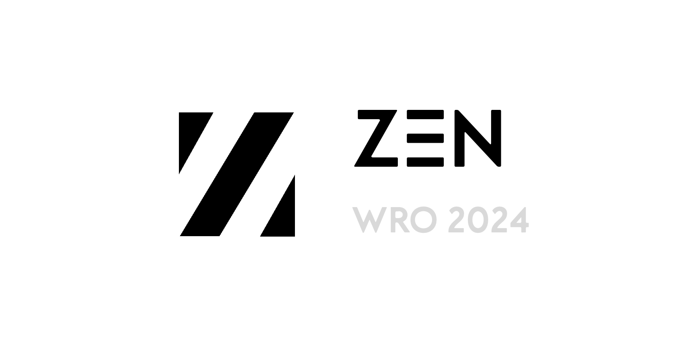

  

# Engineering Materials

## Introduction

This repository contains engineering materials for Team **ZEN** (**Z**one of **E**ngineering **N**ewcomers) participating in the WRO Future Engineers competition in the season 2024.

## Content

- [`t-photos`](/t-photos/) contains 2 photos of the team (an official one and one funny photo with all team members).
- [`v-photos`](/v-photos/) contains 6 photos of the vehicle (from every side, from top and bottom).
- [`video`](/video/) contains the video.md file with the link to a video where driving demonstration exists.
- [`schemes`](/schemes/) contains one or several schematic diagrams in form of PNG and PDF of the electromechanical components illustrating all the elements (electronic components and motors) used in the vehicle and how they connect to each other.
- [`src`](/src/) contains code of control software for all components which were programmed to participate in the competition.
- [`models`](/models/) is for the files for models used by 3D printers to produce the vehicle elements.
- [`other`](/other/) is for other files which can be used to understand how to prepare the vehicle for the competition. It may include documentation how to connect to a SBC/SBM and upload files there, datasets, hardware specifications, communication protocols descriptions etc.

## Full Documentation

See the [Wiki](https://github.com/Zone-of-Engineering-Newcomers/wro2024-fe-ZEN/wiki) for full documentation, operational details and other information.
