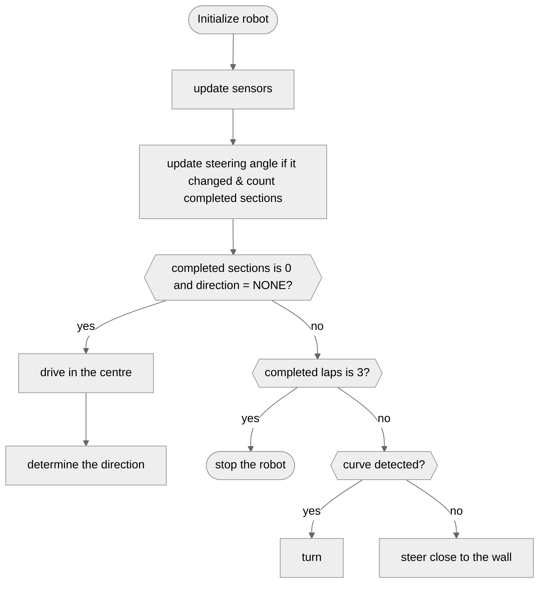

# Algorithm

## Flowchart

```mermaid
%%{init: {'theme':'neutral'}}%%

graph TD

id1([Initialize robot]) --> id2[update sensors]
id2 --> id3[update steering angle if it changed & count completed sections]
id3 --> id4{{completed sections is 0 and direction = NONE?}}
id4 -- yes --> id5[drive in the centre]
id5 --> id6[determine the direction]
id4 -- no --> id7{{completed laps is 3?}}
id7 -- yes --> id8([stop the robot])
id7 -- no --> id9{{curve detected?}}
id9 -- yes --> id10[turn]
id9 -- no --> id11[steer close to the wall]
```
